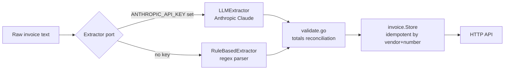
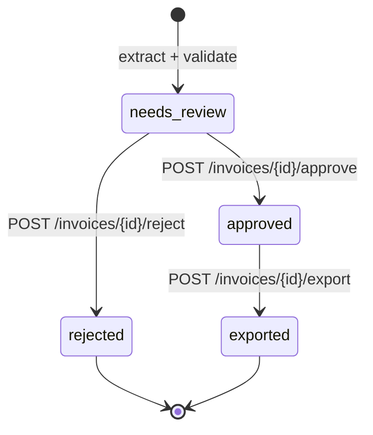

# DocSense


**AI invoice intelligence** — extract structured data from raw invoice text, validate totals, route through an approval workflow, and export to accounting.

Zero external dependencies (Go stdlib only). The LLM extraction seam is already wired — point it at Anthropic Claude to go production-ready.

---

## Features

| Capability | Details |
|---|---|
| **Dual extraction** | Rule-based regex parser (tested workhorse) + LLM extractor (Anthropic Claude) via clean port |
| **Validation** | Line-item totals reconciliation against invoice total; required-field checks |
| **Approval workflow** | State machine: `needs_review → approved / rejected → exported` with typed error guards |
| **Idempotent storage** | Dedup by `(vendor, invoice_number)` — import the same invoice twice safely |
| **CSV export** | One-click export of approved invoices to CSV |
| **stdlib only** | No frameworks, no ORMs, no external dependencies — pure Go 1.22 |
| **Thread-safe** | In-memory store with mutex guards (→ Postgres in prod) |

---

## Extraction pipeline



## Approval workflow



State transitions are guarded — approving an already-approved invoice returns a typed `ErrInvalidTransition`.

---

## Project layout

```
cmd/server/main.go          entrypoint
internal/
  invoice/
    types.go                Invoice, LineItem, Status
    validate.go             totals reconciliation, required fields
    workflow.go             state machine + typed errors
    export.go               CSV writer
    store.go                thread-safe in-memory store, idempotent by (vendor, number)
  extract/
    extractor.go            Extractor port (interface)
    rulebased.go            regex-based extraction (tested workhorse)
    llm.go                  LLMExtractor + LLMClient seam → Anthropic in prod
  httpapi/
    handler.go              stdlib net/http 1.22 ServeMux
```

---

## Quick Start

```bash
go build ./...
go vet ./...
go test ./...   # 14 tests

# Run (rule-based extractor, no LLM key needed)
go run ./cmd/server/main.go

# Run with Anthropic LLM extraction
ANTHROPIC_API_KEY=sk-ant-... go run ./cmd/server/main.go
```

### Docker

```bash
# Without LLM
docker build -t docsense .
docker run -p 8080:8080 docsense

# With Anthropic Claude
docker run -p 8080:8080 \
  -e ANTHROPIC_API_KEY=sk-ant-... \
  -e ANTHROPIC_MODEL=claude-3-haiku-20240307 \
  docsense
```

---

## API Reference

| Method | Path | Description |
|--------|------|-------------|
| `POST` | `/invoices/extract` | Extract invoice from raw text (rule-based or LLM) |
| `GET` | `/invoices` | List all invoices |
| `GET` | `/invoices/{id}` | Get invoice details |
| `POST` | `/invoices/{id}/approve` | Approve invoice |
| `POST` | `/invoices/{id}/reject` | Reject with reason |
| `POST` | `/invoices/{id}/export` | Export to CSV |
| `GET` | `/health` | Health check |

**Extract an invoice:**
```bash
curl -X POST http://localhost:8080/invoices/extract \
  -H 'content-type: application/json' \
  -d '{
    "text": "INVOICE\nVendor: Acme Corp\nInvoice #: INV-001\nDate: 2025-06-01\nItem: Widget  Qty: 5  Price: $20.00\nTotal: $100.00"
  }'
```

**Approve and export:**
```bash
curl -X POST http://localhost:8080/invoices/inv_001/approve
curl -X POST http://localhost:8080/invoices/inv_001/export
# → returns CSV data
```

---

## Environment Variables

| Variable | Default | Description |
|----------|---------|-------------|
| `PORT` | `8080` | HTTP server port |
| `ANTHROPIC_API_KEY` | `""` | Anthropic key (empty → rule-based extractor) |
| `ANTHROPIC_MODEL` | `claude-3-haiku-20240307` | Claude model for extraction |

---

## Tests

```bash
go test ./...   # 14 tests
```

| Test file | Covers |
|-----------|--------|
| `invoice/validate_test.go` | Totals reconciliation, missing fields, rounding |
| `invoice/workflow_test.go` | State transitions, invalid transition errors |
| `extract/rulebased_test.go` | Regex extraction on various invoice formats |
| `httpapi/handler_test.go` | Full HTTP round-trips: extract → approve → export |

---

## Roadmap

- [x] Rule-based regex extractor (production-tested)
- [x] LLM extraction seam (`LLMClient` port)
- [x] Totals validation and required-field checks
- [x] Approval workflow state machine
- [x] CSV export
- [x] Idempotent storage
- [ ] Wire real Anthropic client (seam is ready)
- [ ] PDF/image input via OCR
- [ ] Postgres persistence adapter
- [ ] Bulk import endpoint
- [ ] Accounting system webhooks (QuickBooks, Xero)

---

## License

MIT
