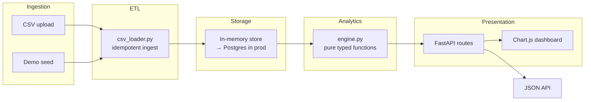

# PulseBoard


**E-commerce analytics & KPI cockpit** — revenue trends, cohort retention, customer LTV, churn and repeat-purchase rates in one dashboard.

Point PulseBoard at your order history (CSV or API) and it computes the metrics that actually drive decisions — no BI tool license required.

---

## Features

| Capability | Details |
|---|---|
| **Revenue analytics** | Daily/weekly/monthly revenue, AOV, new vs. returning customers |
| **Cohort retention** | Month-over-month retention matrix (who came back after month 1, 2, 3…) |
| **Customer LTV** | Per-customer lifetime value distribution |
| **Churn rate** | Trailing 30/90-day churn calculation |
| **Repeat-purchase rate** | % of customers with 2+ orders |
| **Top products** | By revenue and units sold; low-stock alerts |
| **Idempotent CSV import** | Dedup by `order_id` — re-import the same file safely |
| **Live demo data** | Deterministic 6-month seed on startup |

---

## Architecture



### Module map

```
app/
  domain/models.py        Order, OrderLine, Product domain types
  analytics/engine.py     pure functions: revenue, cohort, LTV, churn, top-products
  etl/csv_loader.py       tolerant CSV parser, idempotent by order_id
  api/
    main.py               FastAPI app factory + demo seed
    store.py              in-memory store (→ Postgres adapter in prod)
  static/index.html       Chart.js dashboard (KPI cards, revenue chart, cohort heatmap)
tests/
  test_engine.py          analytics function unit tests
  test_etl.py             CSV import + idempotency tests
  test_api.py             HTTP integration tests
```

**Pure analytics engine:** `engine.py` is a collection of typed pure functions — no side effects. Every metric is tested in isolation with no database, no HTTP, just data in → metrics out.

---

## Quick Start

```bash
python -m venv .venv && source .venv/bin/activate
pip install -e ".[dev]"

# Quality gates
ruff check app tests   # lint
mypy app               # strict type check
pytest -q              # 20 tests

# Run
uvicorn app.api.main:app --reload
# → Dashboard: http://localhost:8000/
# → API docs:  http://localhost:8000/docs
```

### Docker

```bash
docker build -t pulseboard .
docker run -p 8000:8000 pulseboard
# Dashboard auto-seeds 6 months of demo data on boot
```

---

## Dashboard preview

```
┌──────────────────────────────────────────────────────────────────┐
│  PulseBoard                                          Last 30 days│
├────────────┬────────────┬────────────┬────────────┬─────────────┤
│  Revenue   │    AOV     │  New Cust  │   Churn    │ Repeat Rate │
│  $48,320   │  $127.43   │    182     │   3.2%     │   41.7%     │
├────────────┴────────────┴────────────┴────────────┴─────────────┤
│  Revenue trend (6 months)        │  Cohort Retention Matrix      │
│  ▁▃▅▆▇█                         │  M0  M1  M2  M3  M4  M5      │
│                                  │  100  62  48  37  29  23 %   │
├──────────────────────────────────┴───────────────────────────────┤
│  Top Products by Revenue                                         │
│  1. Widget Pro    $12,400  (97 sold)                             │
│  2. Starter Kit    $8,200  (164 sold)                            │
│  3. Add-on Bundle  $5,100  (51 sold)                             │
└──────────────────────────────────────────────────────────────────┘
```

---

## API Reference

| Method | Path | Description |
|--------|------|-------------|
| `GET` | `/` | Chart.js dashboard |
| `GET` | `/api/v1/stores/{id}/kpis` | Revenue, AOV, new/returning customers |
| `GET` | `/api/v1/stores/{id}/cohorts` | Cohort retention matrix |
| `GET` | `/api/v1/stores/{id}/ltv` | Customer LTV distribution |
| `GET` | `/api/v1/stores/{id}/churn` | Churn rate (trailing 30/90 days) |
| `GET` | `/api/v1/stores/{id}/top-products` | Top products by revenue |
| `POST` | `/api/v1/stores/{id}/import` | Import CSV orders (idempotent) |

**CSV format:**
```
order_id, customer_id, created_at, product_id, quantity, unit_price_cents
```

---

## Environment Variables

| Variable | Default | Description |
|----------|---------|-------------|
| `DATABASE_URL` | — | Postgres data warehouse URL |
| `SEED_DEMO_DATA` | `true` | Auto-seed 6 months of demo data on startup |

---

## Tests

```bash
pytest -q   # 20 tests
```

| Test file | Covers |
|-----------|--------|
| `test_engine.py` | Revenue, AOV, cohort matrix, LTV, churn, repeat rate, top products |
| `test_etl.py` | CSV parse, idempotent dedup, malformed/missing columns |
| `test_api.py` | KPI, cohort, churn, import endpoints |

---

## Roadmap

- [x] Pure analytics engine (revenue, cohort, LTV, churn)
- [x] Idempotent CSV import
- [x] Chart.js dashboard with demo seed
- [x] mypy strict + ruff clean
- [ ] Postgres data warehouse + scheduled ETL (Airflow/cron)
- [ ] Real-time updates via WebSocket
- [ ] Segmentation filters (date range, product category, channel)
- [ ] CSV/PDF report export
- [ ] Shopify / WooCommerce connector

---

## License

MIT
