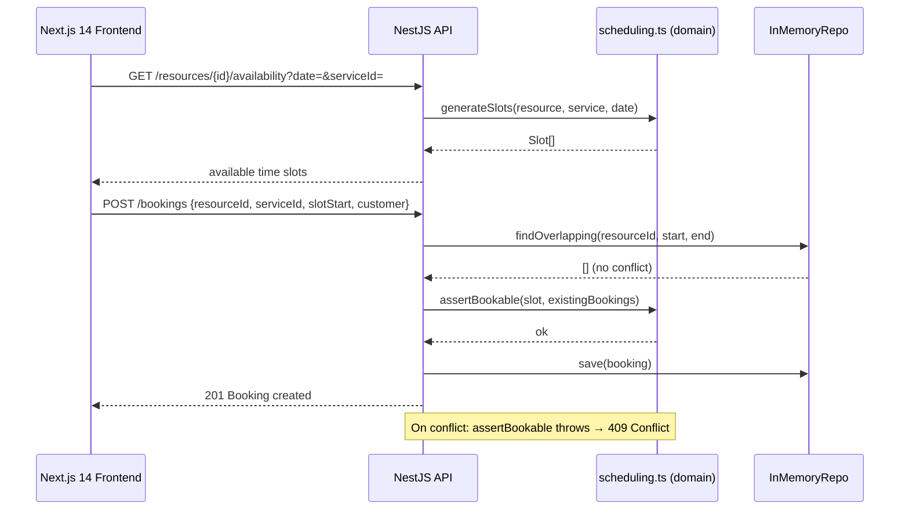

# SlotPilot


**Booking & scheduling API with zero double-booking guarantee** — a full-stack booking system for service businesses (salons, clinics, tutors, studios).

Customers see real-time availability; the domain engine enforces strict no-overlap invariants so two bookings can never land on the same slot.

---

## Features

| Capability | Details |
|---|---|
| **Zero double-booking** | Pure scheduling engine with atomic overlap check using half-open intervals |
| **Slot generation** | Computes available slots from resources, services, and working hours |
| **Full-stack** | NestJS REST backend + Next.js 14 App Router frontend |
| **4-step booking flow** | Service → Day → Time → Details → Confirmation |
| **CORS configurable** | `CORS_ORIGINS` env var for separate frontend deployment |
| **Strict TypeScript** | `tsc --strict` clean across backend and frontend |
| **Ports & adapters** | In-memory repo → swap to Postgres + `EXCLUDE USING gist` without touching domain |

---

## Architecture



### Backend (`src/`)

```
domain/
  scheduling.ts     # pure: slot generation, assertBookable, half-open intervals
  time.ts           # UTC time utilities
application/
  booking.service.ts  # orchestrates domain + repo
  ports.ts            # IBookingRepo interface
infrastructure/
  in-memory.repo.ts   # atomic overlap check (→ Postgres EXCLUDE USING gist in prod)
http/
  booking.controller.ts  # NestJS controller, DTOs, domain-error filter
main.ts               # CORS via CORS_ORIGINS env
```

### Frontend (`web/`)

```
app/
  page.tsx          # step 1: service picker
  [resourceId]/
    book/
      page.tsx      # step 2–4: date, time slot, customer details
    confirm/
      page.tsx      # confirmation screen
lib/api.ts          # typed API client (NEXT_PUBLIC_API_URL)
components/         # reusable UI pieces
```

---

## Quick Start

### Backend

```bash
npm install
npm run typecheck   # tsc --strict
npm test            # 21 tests
npm run build
PORT=3000 npm start
```

### Frontend

```bash
cd web
npm install
npm run typecheck
npm run build
NEXT_PUBLIC_API_URL=http://localhost:3000 npm run dev
# → http://localhost:3001
```

### Docker

```bash
docker build -t slotpilot .
docker run -p 3000:3000 \
  -e CORS_ORIGINS=https://mybooking.com \
  slotpilot
```

---

## API Reference

| Method | Path | Description |
|--------|------|-------------|
| `GET` | `/resources` | List resources with their services |
| `GET` | `/resources/{id}/availability` | Available slots for `?date=YYYY-MM-DD&serviceId=X` |
| `POST` | `/bookings` | Create booking |
| `GET` | `/bookings/{id}` | Get booking details |
| `DELETE` | `/bookings/{id}` | Cancel booking |

**POST /bookings body:**
```json
{
  "resourceId": "res_alex",
  "serviceId": "svc_haircut",
  "slotStart": "2025-06-10T09:00:00Z",
  "customerName": "Alice",
  "customerEmail": "alice@example.com"
}
```

---

## Environment Variables

| Variable | Default | Description |
|----------|---------|-------------|
| `PORT` | `3000` | Backend port |
| `CORS_ORIGINS` | `http://localhost:3001` | Comma-separated allowed origins |
| `NEXT_PUBLIC_API_URL` | `http://localhost:3000` | Frontend → backend base URL |

---

## Tests

```bash
npm test          # backend: 21 tests
```

| Test file | Covers |
|-----------|--------|
| `scheduling.spec.ts` | Slot generation, edge cases, gap detection |
| `booking.service.spec.ts` | Application layer, double-booking rejection |
| `booking.e2e.spec.ts` | HTTP integration, 201 vs 409 scenarios |

---

## Roadmap

- [x] Zero double-booking domain engine
- [x] NestJS backend with ports & adapters
- [x] Next.js 14 App Router frontend (4-step flow)
- [x] CORS support
- [ ] Postgres + `EXCLUDE USING gist` constraint
- [ ] SMS/email booking reminders
- [ ] Recurring bookings
- [ ] Staff management dashboard
- [ ] Multi-timezone support

---

## License

MIT
